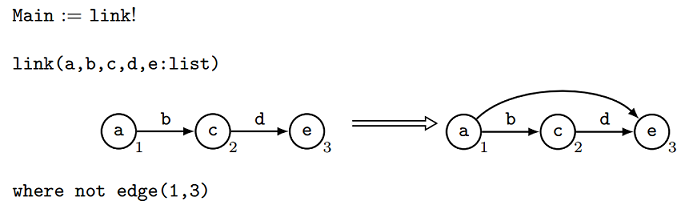
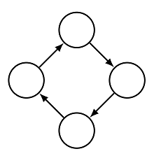
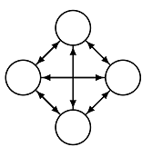

# Getting Started

The GP 2 compiler translates a GP 2 program into executable C code. The generated code is executable with the support of the GP 2 library. There are two ways to set it up. You can build the compiler using make. However, the setup process is not guaranteed to be stable on all Linux machines, or on machines running MacOS or Windows. We therefore provide an installation via Docker as an alternative for Linux and MacOS.

## Installation via Docker
This installation method requires Docker. The program can be found in your software repository or on the [Docker website](https://docs.docker.com/install/). For institutions, [Rootless Docker](https://medium.com/@tonistiigi/experimenting-with-rootless-docker-416c9ad8c0d6) may be the preferred choice since it does not allow users to execute programs as a root user.

To set up GP 2 via Docker, use the command below as a superuser to run a GP 2 program. The first time you run the command, Docker will download the necessary files for executing GP 2 programs. Subsequently, programs can be run offline.
```
docker run -v ${PWD}:/data registry.gitlab.com/yorkcs/batman/gp2i:latest <program> <input graph>
```
Replace ``<program>`` with the relative path to your program from your working directory, and ``<input graph>`` with the relative path to your input graph.

You can also pass flags to the compiler:
```
docker run -v ${PWD}:/data -e GP2_FLAGS='-f -q' registry.gitlab.com/yorkcs/batman/gp2i:latest <program> <input graph>
```

The following is the list of compiler flags:

- **-d** - Compile program with debugging flags.
- **-f** - Compile in fast shutdown mode.
- **-g** - Compile with minimal garbage collection (requires fast shutdown).
- **-m** - Compile with root reflecting matches.
- **-n** - Compile without graph node lists.
- **-q** - Compile program quickly without optimisations.
- **-l** - Specify directory of lib source files.
- **-o** - Specify directory for generated code and program output.

For a more concise command, you can download this [bash file](https://github.com/UoYCS-plasma/GP2/blob/master/Compiler/Bash%20Files/gp2docker).

## Installation via Make

After downloading the files from the [GP 2 Github Page](https://github.com/UoYCS-plasma/GP2/). Then in the folder `GP2/Compiler` run the following commands.
1. `autoreconf -i`
2. `autoconf -i`
3. `automake -a`
4. `./configure`
5. `make dist`
6. `tar -xzvf gp2-1.0.tar.gz`
7. `cd gp2-1.0`
8. `./configure --prefix=<path_to_build_directory>` where `<path_to_build_directory>` is where you want the compiler to reside.
8. `cp ../lib/*.{c,h} lib/`
9. `make`
10. `make install`

You can now compile GP 2 programs using the `gp2`. From the `bin` folder, run
```
./gp2 [-d] [-f] [-g] [-m] [-n] [-q] [-l <libdir>] [-o <outdir>] <program_file>
```

Compiles *gp2-program* into C code. The generated code is placed in
*/tmp/gp2* unless an alternate location is specified with the **-o** flag. 

To execute the generated code, run `./build.sh` and
`./gp2run <graph_file>` from */tmp/gp2*.

Before executing, you may need to copy library files from the source code.
```
cp <path_to_source_code_directory>/lib/*.{c,h} ./gp2_code_temp/
```

If GP 2 is installed in a non-standard directory, use the **-l** option to 
ensure the generated code can be compiled and executed.

The following is the list of compiler flags:

- **-d** - Compile program with debugging flags.
- **-f** - Compile in fast shutdown mode.
- **-g** - Compile with minimal garbage collection (requires fast shutdown).
- **-m** - Compile with root reflecting matches.
- **-n** - Compile without graph node lists.
- **-q** - Compile program quickly without optimisations.
- **-l** - Specify directory of lib source files.
- **-o** - Specify directory for generated code and program output.

The compiler can also be used to validate GP 2 source files.
- Run `gp2 -p <program_file>` to validate a program.
- Run `gp2 -r <rule_file>` to validate a rule.
- Run `gp2 -h <host_file>` to validate a host graph.

You can use the `gp2c` [bash file](https://github.com/UoYCS-plasma/GP2/blob/master/Compiler/Bash%20Files/gp2c) to concisely run GP 2 programs using `./gp2c <program_file> <graph_file>`. Just modify `install_dir` and `source_dir` to be the paths to the installation and source code respectively.

## Example: Editing, Compiling, and Running a Transitive Closure Program

For this section, we assume to have a bash file `gp2bash` which we can run GP 2 programs with using `./gp2bash <program_file> <graph_file>`

The program we'll look at is this:



This program computes the **transitive closure** of a graph. The transitive closure of a graph is the smallest extension of that graph that is **transitive**.
A graph is transitive when for every pair of nodes *v1, v2* with a path from *v1* to *v2*, there is an edge directly from *v1* to *v2*.

For example, this graph is *not* transitive:



There is a path from the left-most node to the right-most node but there is no edge directly from the left-most node to the right-most node. 
The purpose of the program we're looking at is the *transform* this graph into the smallest extension of this graph which *is* transitive. 

Firstly, let's get this graph in a usable form. Try writing the graph out as:

```
[
	(0, empty)
	(1, empty)
	(2, empty)
	(3, empty)
	|
	(4, 0, 1, empty)
	(5, 1, 2, empty)
	(6, 2, 3, empty)
	(7, 3, 0, empty)
]
```

What does this mean? Well the square brackets `[ ... ]` surround the entire graph's structure. Then the nodes are listed, for example; `(0, empty)` indicates that there is
a node which we will identify as node 0 and this node is unlabelled (its label is 'empty'). After the nodes are listed, there is a divider; `|`, and then edges are
listed. The edge `(4, 0, 1, empty)` describes an edge from node 0 to node 1 which is also unlabelled. 

Save this graph as *"cycle.host"*. 


Try writing this program out in text form:

```
Main = link!

link(a, b, c, d, e : list)
[
	(n1, a)
	(n2, c)
	(n3, e)
	|
	(e1, n1, n2, b)
	(e2, n2, n3, d)
]
=>
[
	(n1, a)
	(n2, c)
	(n3, e)
	|
	(e1, n1, n2, b)
	(e2, n2, n3, d)
	(e3, n1, n3, empty)
]
interface = 
{
	n1, n2, n3
}
where not edge(1, 3)
```

and saving it as *"transitive_closure.gp2"*. The general form of a program in text form is:

```
Main = [PROGRAM CODE]

[RULE 1]
[RULE 2]
[RULE 3]
```

And an individual rule is of the form:

```
[RULENAME]
(
	[VARIABLES]
)
[LEFT HAND SIDE GRAPH]
=>
[RIGHT HAND SIDE GRAPH]
interface = { [INTERFACE] }
[CONDITION]
```

Where graphs are of the same form as the graph we saw earlier. 

So what does our program mean? The only line of the main program is `Main = link!`. This `!`  means that the rule `link` will be applied as long as possible - e.g. it will be applied
until it is no longer applicable. Applying the rule `link` firstly searches for a match for its left hand side; 3 adjacent nodes where there is not an edge
from the 1st node to the 3rd node. Then, once a match is found, the left hand side is transformed into the right hand side by inserting an edge from the 1st
node to the 3rd node. The 'interface' describes which nodes survive; none of the 3 matched nodes `n1, n2, n3` are deleted. 

Now we can compile our program by calling:

```
./gp2bash PATH/TO/transitive_closure.gp2 PATH/TO/cycle.host
```
This will generate a file *"gp2.output"* which contains this produced graph:



## Copying

See the file [COPYING](COPYING).

## Authors

The GP 2 language was designed by [Detlef Plump](http://www-users.cs.york.ac.uk/~det/).

The GP 2 compiler and runtime library was developed by Christopher Bak. Recent improvements to the compiler were implemented by [Graham Campbell](https://gjcampbell.co.uk/) and [Jack Romo](http://jackromo.com/).
